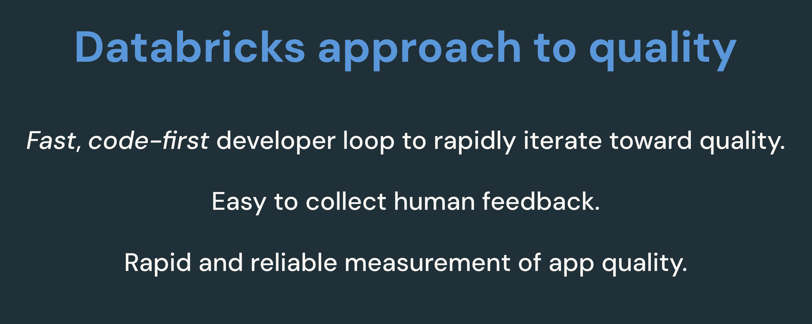

# RAG Application Sample Code

This repository contains a comprehensive sample implementation of a Retrieval-Augmented Generation (RAG) application using Databricks. The codebase is organized to support both initial POC development and subsequent quality improvements.

## Repository Structure

```
rag_app_sample_code/
├── A_POC_app/                    # Initial POC implementation
│   ├── pdf_uc_volume/           # PDF document processing pipeline
│   ├── docx_uc_volume/          # Word document processing pipeline
│   ├── pptx_uc_volume/          # PowerPoint document processing pipeline
│   ├── html_uc_volume/          # HTML document processing pipeline
│   ├── databricks_docs_example/ # Example using Databricks documentation
│   └── z_shared_utilities.py    # Shared utility functions for POC
├── B_quality_iteration/          # Quality improvement implementations
│   ├── chain_code_fixes/        # Improvements to RAG chain code
│   ├── data_pipeline_fixes/     # Enhancements to data processing pipeline
│   └── z_shared_utilities.py    # Shared utilities for quality improvements
├── resources/                    # Shared resources and assets
├── helpers/                     # Helper functions and utilities
├── global_config.yaml           # Global configuration settings
├── 00_global_config.py         # Configuration initialization
└── 01_validate_config_and_create_resources.py  # Resource setup and validation
```

## Components

### A. POC Application
The POC implementation (`A_POC_app/`) provides a starting point for building a RAG application with support for various document formats:
- PDF processing pipeline with UC Volume integration
- Word document processing capabilities
- PowerPoint presentation processing
- HTML document processing
- Example implementation using Databricks documentation

### B. Quality Iteration
The quality improvement section (`B_quality_iteration/`) contains:
- Root cause analysis tools for quality issues
- Enhanced RAG chain implementations
- Improved data processing pipelines
- Evaluation frameworks for measuring improvements

## Key Features

1. **Multi-format Support**: Process various document formats (PDF, DOCX, PPTX, HTML)
2. **Databricks Integration**: 
   - Vector Search integration
   - MLflow experiment tracking
   - UC Volume support
3. **Configurable Pipeline**:
   - Customizable chunking strategies
   - Flexible embedding configurations
   - Adjustable retrieval parameters

## Getting Started

1. Configure the environment using `global_config.yaml`
2. Run `00_global_config.py` to initialize configuration
3. Execute `01_validate_config_and_create_resources.py` to set up required resources
4. Choose appropriate document pipeline from `A_POC_app/` based on your use case
5. Iterate and improve using tools in `B_quality_iteration/`

## Quality Improvement Workflow

1. Use `01_root_cause_quality_issues.py` to identify areas for improvement
2. Implement fixes in either `chain_code_fixes/` or `data_pipeline_fixes/`
3. Evaluate improvements using `02_evaluate_fixes.py`

## Configuration

The application uses a hierarchical configuration system:
- Global settings in `global_config.yaml`
- Pipeline-specific configurations in respective directories
- Quality iteration parameters in the B_quality_iteration section

## Dependencies

- Databricks Runtime Environment
- Vector Search capabilities
- MLflow for experiment tracking
- Various document processing libraries based on format (PyPDF, python-docx, etc.)

## Best Practices

1. Start with the POC implementation in `A_POC_app/`
2. Use the provided evaluation tools to measure baseline performance
3. Iterate through quality improvements using `B_quality_iteration/`
4. Maintain configuration consistency across environments
5. Monitor and log all pipeline stages using MLflow

# Retrieval Augmented Generation

Please visit http://ai-cookbook.io for the accompanying documentation for this repo.

This repo provides production-ready code to build a **high-quality RAG application** using Databricks. This repo complements the  [Mosaic Generative AI Cookbook](https://ai-cookbook.io) which provides:
  - A conceptual overview and deep dive into various Generative AI design patterns, such as Prompt Engineering, Agents, RAG, and Fine Tuning
  - An overview of Evaluation-Driven development
  - The theory of every parameter/knob that impacts quality
  - How to root cause quality issues and detemermine which knobs are relevant to experiment with for your use case
  - Best practices for how to experiment with each knob

This repo is intended for use with the Databricks platform.  Specifically:
- [Mosaic AI Agent Framework](https://docs.databricks.com/en/generative-ai/retrieval-augmented-generation.html) which provides a fast developer workflow with enterprise-ready LLMops & governance
- [Mosaic AI Agent Evaluation](https://docs.databricks.com/en/generative-ai/agent-evaluation/index.html) which provides reliable, quality measurement using proprietary AI-assisted LLM judges to measure quality metrics that are powered by human feedback collected through an intuitive web-based chat UI



